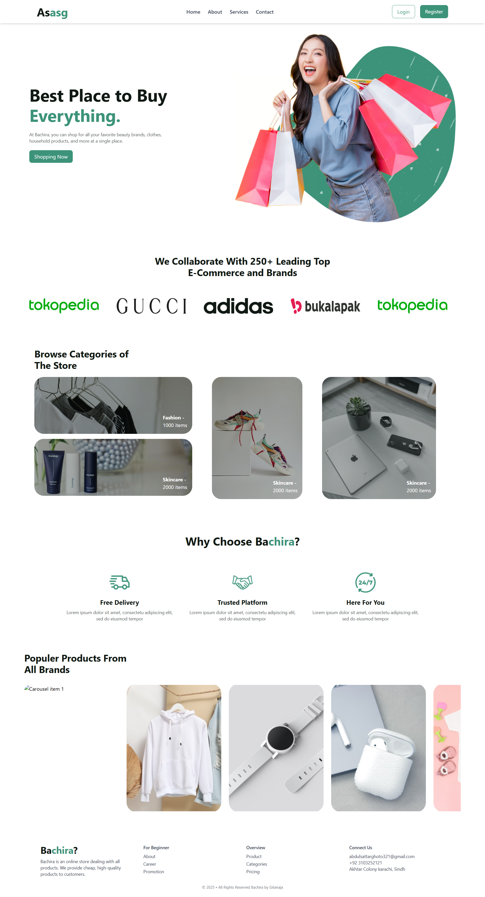

# 🛍️ Shopping Website

## 🌟 Overview
Welcome to the **Shopping Website** – a fully responsive and modern e-commerce platform built using **React.js**, **Tailwind CSS**, and **TypeScript**. This website provides users with a smooth and engaging online shopping experience, including product browsing, adding items to the cart, and an efficient checkout process.

## 🚀 Features
- 🛒 **Product Listing** – Displays a diverse range of products with high-quality images, detailed descriptions, and accurate pricing.
- 🔍 **Advanced Search & Filter** – Users can quickly find products using search functionality and category-based filtering.
- 🏷 **Add to Cart & Wishlist** – Seamless cart management with quantity updates and a wishlist feature.
- 💳 **Secure Checkout Process** – Ensures a smooth and secure transaction experience.
- 📦 **Order Tracking** – Users can track their orders in real-time.
- 🌙 **Dark Mode Support** – Provides a stylish dark mode for an improved user experience.
- 📱 **Mobile-Optimized Design** – Fully responsive across desktops, tablets, and mobile devices.
- ⚡ **Lightning-Fast Performance** – Optimized with Vite for quick loading times.

## 🖼️ Screenshots
Take a look at the interface of the Shopping Website:

  

_(Make sure to add your actual screenshots inside a `screenshots` folder in the repository)_

## 🛠️ Installation
Follow these steps to set up and run the project locally:

### 📥 Clone the Repository:
```sh
git clone https://github.com/absattarghoto/shopping_website.git
cd shopping_website
```

### 📦 Install Dependencies:
```sh
yarn install  # or npm install
```

### 🚀 Start the Development Server:
```sh
yarn dev  # or npm run dev
```

The project will be running at `http://localhost:5173/` (default Vite port).

## 🏗️ Technologies Used
- ⚛ **React.js** – For building the interactive UI.
- 🟦 **TypeScript (TSX)** – For enhanced type safety and maintainability.
- 🎨 **Tailwind CSS** – For sleek, responsive styling.
- ⚡ **Vite** – Ensures blazing-fast development and optimized builds.

## 🎯 Usage Guide
1. 🏪 Open the website and browse through available products.
2. 🔎 Use the search bar and filters to find specific items.
3. 📖 Click on a product to view details and pricing.
4. 🛒 Add items to your cart and manage quantities.
5. ✅ Proceed to checkout and complete your order securely.
6. 📦 Track your orders in real time.

## 🤝 Contribution Guidelines
We welcome contributions! To contribute, follow these steps:
1. 🍴 Fork the repository.
2. 🛠️ Create a feature branch (`git checkout -b feature-branch`).
3. ✏️ Make changes and commit (`git commit -m 'Added a new feature'`).
4. 🚀 Push changes (`git push origin feature-branch`).
5. 🔄 Open a Pull Request and contribute to the project.

## 📜 License
This project is licensed under the **MIT License**, making it open-source and free to use.

---

💡 **Stay tuned for upcoming features and improvements!** 🚀